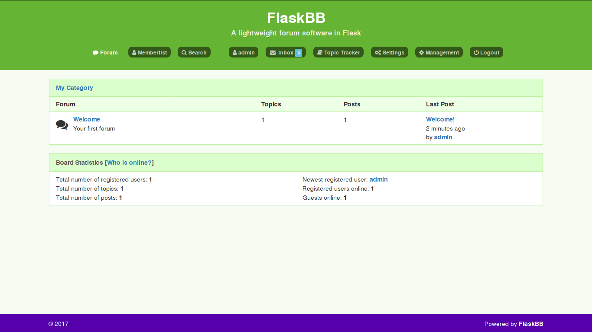

# FlatGreen

A green theme for FlaskBB, heavily based on the Aurora theme.

# INSTALLATION

Put all contents of this directory in the folder:
path/to / flaskbb/themes/flatgreen

Then you should be able to activate it in the settings,
either as global default or just for your user account.

# PREVIEW

